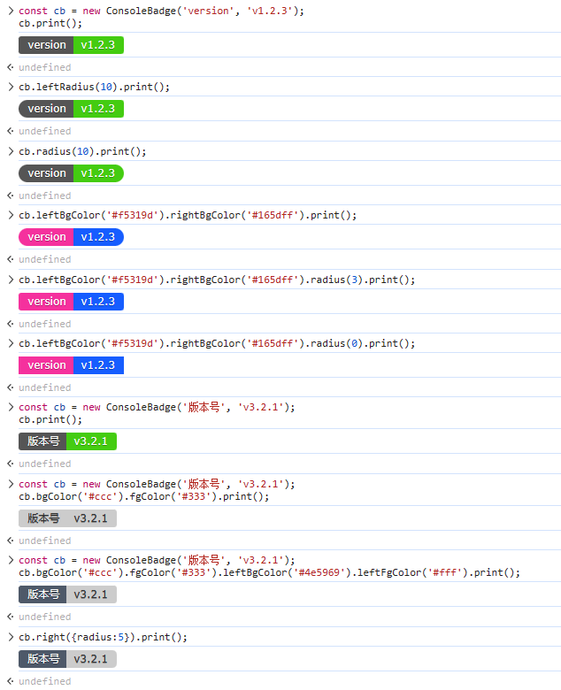

<div align="center">

# @kwooshung/ConsoleBadge


[](https://www.npmjs.com/package/@kwooshung/console-badge)
[](https://www.npmjs.com/package/@kwooshung/console-badge)
[](https://github.com/kwooshung/ConsoleBadge/actions/)
[](https://codecov.io/gh/kwooshung/ConsoleBadge)
[](https://codeclimate.com/github/kwooshung/ConsoleBadge/maintainability)
[](LICENSE)
[](https://gitee.com/kwooshung/OasisEditor/)


<p align="center">
    <a href="README.zh-CN.md">中文</a> | 
    <a href="README.md" style="font-weight:700;color:#165dff;text-decoration:underline;">English</a>
</p>
</div>

# Why Develop It?

In open source programs, there are various badges, just like the badges shown above; I hope that such badges can also be displayed in the console to facilitate the display of current program information, such as version number, build time, build status, etc. and other information.

# Why Use It?

- Supports bilingual annotations in both Chinese and English;
- Low learning cost, chain calling, simple and flexible use;
- Implemented with modern features of **ES6**;
- Written in **TypeScript** for type safety;
- Pure script, can depend on any framework, any platform, any environment;
- Supports on-demand import, `esm` modularization, natively supports **tree-shaking**, no worries about the size after packaging;
- Of course, this project also provides a `commonjs` standard `cjs` version;
- Test coverage of **100%**.

# Install

## npm

```bash
npm install @kwooshung/console-badge
```

## yarn

```bash
yarn add @kwooshung/console-badge
```

## pnpm

```bash
pnpm add @kwooshung/console-badge
```

# Usage

## Basic Usage:

```typescript
import ConsoleBadge from 'console-badge';

const cb = new ConsoleBadge('version', 'v1.2.3');
cb.[various configuration functions, supporting chain calls].print();
```

## Demo Screenshot

> Below is a demonstration of some of the functions;



## Why are the functions not listed here?

- Initially, I thought of listing them, but considering the simplicity of use and straightforward code, it's better to view the source code directly [Click here to view the source code](./src/index.ts).
- The function names are quite intuitive, so there's no need to worry about understanding them.
- If you're using TypeScript, you'll get prompts, and the comments are in both Chinese and English, making it very simple to use. There's nothing to worry about.
